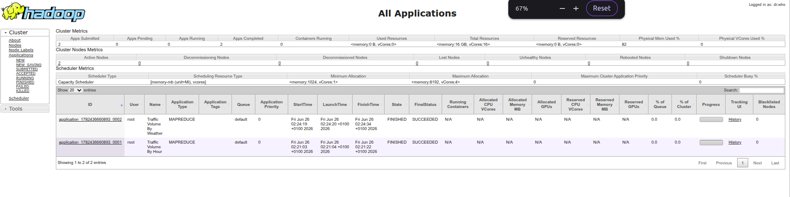

# Smart Traffic Monitoring System

<p align="center">
  
  
  
  
  
  
</p>

<p align="center">
  <b>Big Data pipeline combining Hadoop MapReduce batch analytics with Apache Spark Streaming real-time processing on metropolitan traffic data.</b>
</p>

---

## Table of Contents

1. [Overview](#overview)
2. [Project Objectives](#project-objectives)
3. [Technologies](#technologies)
4. [System Architecture](#system-architecture)
5. [Data Flow](#data-flow)
6. [Project Structure](#project-structure)
7. [Dataset](#dataset)
8. [Quick Start](#quick-start)
9. [Docker Deployment](#docker-deployment)
10. [Running Hadoop MapReduce](#running-hadoop-mapreduce)
11. [Running Spark Streaming — Automated Mode](#running-spark-streaming--automated-mode)
12. [Running Spark Streaming — Manual Demo Mode](#running-spark-streaming--manual-demo-mode)
13. [Web UIs](#web-uis)
14. [Screenshots](#screenshots)
15. [Expected Outputs](#expected-outputs)
16. [Streaming Pipeline — Technical Deep Dive](#streaming-pipeline--technical-deep-dive)
17. [Troubleshooting](#troubleshooting)
18. [Build from Source](#build-from-source)
19. [Future Improvements](#future-improvements)
20. [Author](#author)

---

## Overview

**SmartTrafficMonitoring** is a university Big Data project that demonstrates a complete two-layer analytics pipeline on the [Metro Interstate Traffic Volume dataset](https://archive.ics.uci.edu/ml/datasets/Metro+Interstate+Traffic+Volume) (48,204 hourly records from Interstate 94, Minneapolis, 2012–2018).

The system is composed of two independent but complementary processing layers:

| Layer | Technology | Purpose |
|---|---|---|
| **Batch** | Hadoop MapReduce on YARN | Historical traffic analysis: average per hour, average per weather condition, peak/lowest identification |
| **Streaming** | Apache Spark Streaming | Real-time traffic monitoring: congestion detection, running average, windowed weather aggregation |

Both layers run on a six-container Docker cluster (3 Hadoop nodes + 3 Spark nodes) that reproduces a production-grade Big Data infrastructure on a single machine.

---

## Project Objectives

1. Apply **Hadoop MapReduce** to compute batch aggregations on a historical dataset stored in **HDFS**.
2. Simulate a **live traffic sensor feed** using a TCP socket producer that replays the dataset in real time.
3. Use **Apache Spark Streaming** to process incoming traffic events in 5-second micro-batches.
4. Detect **traffic congestion** in real time (volume > 6 000 vehicles/hour).
5. Maintain a **running traffic average** across all batches using stateful processing (`updateStateByKey`).
6. Compute **weather-based traffic aggregations** over a sliding 30-second window (`reduceByKeyAndWindow`).
7. Deploy the entire pipeline on a **reproducible Docker cluster** — no manual Hadoop/Spark installation required.

---

## Technologies

| Component | Technology | Version |
|---|---|---|
| Language | Java | 8 |
| Build tool | Apache Maven | 3.x |
| Batch processing | Apache Hadoop MapReduce | 3.3.6 |
| Distributed storage | HDFS | 3.3.6 |
| Cluster scheduler | YARN (Yet Another Resource Negotiator) | 3.3.6 |
| Stream processing | Apache Spark Streaming | 2.4.5 |
| Containerisation | Docker + Docker Compose | 3.8 |
| Hadoop Docker image | `fedimriri/hadoop-cluster` | latest |
| Spark Docker image | `fedimriri/spark-image` | latest |
| Producer Docker image | `fedimriri/traffic-producer` | latest |

---

## System Architecture

```
┌─────────────────────────────────────────────────────────────────────────────┐
│                         Smart Traffic Monitoring                            │
│                     Independent Dual-Layer Architecture                     │
└─────────────────────────────────────────────────────────────────────────────┘

  ┌──────────────────────────────────────────────────────────────────────────┐
  │                   LAYER 1 — Hadoop Batch Processing                      │
  │                                                                          │
  │   CSV dataset ──► HDFS ──► MapReduce Job 1 ──► /output/hourly/          │
  │   (on disk)     (HDFS)    (avg per hour,        (hour → avg volume)     │
  │                            peak / lowest)                                │
  │                                                                          │
  │                        ──► MapReduce Job 2 ──► /output/weather/         │
  │                            (avg per weather,    (weather → avg volume)  │
  │                             highest / lowest)                            │
  └──────────────────────────────────────────────────────────────────────────┘

  ┌──────────────────────────────────────────────────────────────────────────┐
  │                   LAYER 2 — Spark Streaming (Real-time)                  │
  │                                                                          │
  │   CSV dataset ──► TrafficDataProducer ──► TCP socket ──► Spark          │
  │   (local file)    (row-by-row replay)     port 9999     Streaming       │
  │                                                         (5 s batch)     │
  │                                                             │            │
  │                                               ┌────────────┴──────────┐ │
  │                                               │  Congestion Detection  │ │
  │                                               │  (volume > 6 000)     │ │
  │                                               │  Running Avg (global) │ │
  │                                               │  Weather Agg (30 s)   │ │
  │                                               └───────────────────────┘ │
  └──────────────────────────────────────────────────────────────────────────┘

  NOTE: The two layers are INDEPENDENT.
  Spark does NOT read Hadoop's output — it reads the original CSV via the
  TCP producer. This is an "Independent Dual-Layer" architecture, not Lambda.
```

### Architecture Type: Independent Dual-Layer (Not Lambda)

| Criterion | This Project | Lambda Architecture |
|---|---|---|
| Batch layer | Hadoop MapReduce on HDFS | Yes (same) |
| Speed layer | Spark Streaming | Yes (same) |
| Speed layer reads batch output? | **No** | Yes |
| Serving layer merges both? | **No** | Yes |
| Data source for streaming | Original CSV via TCP | Recent events only |

The design is intentional: the batch layer answers historical questions ("what is the average volume at 16:00 over 5 years?") while the streaming layer answers real-time questions ("is traffic congested right now?"). They serve different use cases and do not need to be coupled.

---

## Data Flow

### Hadoop Batch Processing

```
dataset/Metro_Interstate_Traffic_Volume.csv
         │
         ▼  (docker cp + hdfs dfs -put)
HDFS: /traffic-data/historical/Metro_Interstate_Traffic_Volume.csv
         │
         ├─► JOB 1: TrafficHourDriver
         │      Mapper  : reads CSV row → emit (hour_HH, traffic_volume)
         │      Shuffle : sort + group by hour key
         │      Reducer : receive (HH, [v₁,v₂,...]) → compute avg
         │                track global PEAK_HOUR and LOWEST_HOUR
         │      Output  : HDFS /traffic-data/output/hourly/part-r-00000
         │
         └─► JOB 2: TrafficWeatherDriver
                Mapper  : reads CSV row → emit (weather_main, traffic_volume)
                Shuffle : sort + group by weather key
                Reducer : receive (weather, [v₁,v₂,...]) → compute avg
                          track HIGHEST_WEATHER and LOWEST_WEATHER
                Output  : HDFS /traffic-data/output/weather/part-r-00000
```

**CSV fields used** (0-indexed):

| Index | Field | Used by |
|---|---|---|
| 5 | `weather_main` | Job 2 Mapper, Streaming Producer |
| 7 | `date_time` | Job 1 Mapper, Streaming Producer |
| 8 | `traffic_volume` | Both Jobs, Streaming Producer |

### Spark Streaming Data Flow

```
dataset/Metro_Interstate_Traffic_Volume.csv (local filesystem)
         │
         ▼  (parsed by TrafficRecord.fromCsvLine)
TrafficDataProducer (ServerSocket on spark-master:9999)
         │
         │  Wire format per line: "2012-10-02 09:00:00,Clouds,5545"
         │
         ▼  (socketTextStream — ReceiverTask on spark-slave1 or spark-slave2)
JavaReceiverInputDStream<String>   [every 5 s → new RDD]
         │
         ▼  filter(non-empty)
JavaDStream<String>
         │
         ▼  flatMap(parse to TrafficEvent, skip malformed lines)
JavaDStream<TrafficEvent>
         │
         ├─► filter(volume > 6000) → foreachRDD → print CONGESTION ALERT
         │
         ├─► mapToPair("GLOBAL", volume)
         │   → updateStateByKey(sum, count)     [stateful — cross-batch]
         │   → foreachRDD → print running average
         │
         └─► mapToPair(weather, volume)
             → reduceByKeyAndWindow(sum, 30 s, 5 s)   [windowed]
             → foreachRDD → print weather aggregation
```

---

## Project Structure

```
SmartTrafficMonitoring/
├── dataset/
│   └── Metro_Interstate_Traffic_Volume.csv   # 48 204 records, ~5 MB
│
├── docs/
│   ├── architecture-diagram.md               # Architecture reference
│   ├── Final_Project_Report.md               # Full technical report
│   └── screenshot/                           # Evidence screenshots
│
├── scripts/
│   ├── connect-networks.sh     # Verify cross-container connectivity
│   ├── start-spark.sh          # Start Spark Master + Workers
│   ├── run-mapreduce.sh        # Build + run both MapReduce jobs
│   ├── start-producer.sh       # Start TCP data producer (automated)
│   ├── start-streaming.sh      # Submit Spark Streaming job
│   └── start-manual-demo.sh   # Manual demo mode (type records by hand)
│
├── src/main/java/com/traffic/
│   ├── mapreduce/
│   │   ├── hourly/
│   │   │   ├── TrafficHourDriver.java    # Job 1 driver
│   │   │   ├── TrafficHourMapper.java    # hour extraction
│   │   │   └── TrafficHourReducer.java   # average + peak/lowest
│   │   └── weather/
│   │       ├── TrafficWeatherDriver.java  # Job 2 driver
│   │       ├── TrafficWeatherMapper.java  # weather extraction
│   │       └── TrafficWeatherReducer.java # average + highest/lowest
│   └── streaming/
│       ├── TrafficDataProducer.java   # TCP socket producer (CSV replay)
│       ├── TrafficRecord.java         # CSV row → wire-format POJO
│       └── TrafficStreamingApp.java   # Spark Streaming consumer
│
├── docker-compose.yml    # 6-container cluster definition
├── pom.xml               # Maven build (Java 8, Hadoop 3.3.6, Spark 2.4.5)
└── README.md
```

---

## Dataset

**Metro Interstate Traffic Volume**

| Attribute | Value |
|---|---|
| File | `dataset/Metro_Interstate_Traffic_Volume.csv` |
| Records | 48,204 hourly observations |
| Period | 2012 – 2018 |
| Road | Interstate 94, Minneapolis–Saint Paul |
| Size | ~5 MB |

**CSV Schema:**

```
holiday, temp, rain_1h, snow_1h, clouds_all, weather_main, weather_description, date_time, traffic_volume
  [0]    [1]    [2]      [3]       [4]           [5]              [6]              [7]          [8]
```

**Example row:**

```
None,288.28,0.0,0.0,40,Clouds,scattered clouds,2012-10-02 09:00:00,5545
```

---

## Quick Start

A completely fresh machine needs only Docker, Docker Compose, Maven, and Java 8 — no local image builds.

### 1 — Clone the repository

```bash
git clone https://github.com/your-org/SmartTrafficMonitoring.git
cd SmartTrafficMonitoring
```

### 2 — Pull all images from Docker Hub

```bash
docker compose pull
```

This downloads:
- `fedimriri/hadoop-cluster:latest` — Hadoop 3.3.6 + YARN + HDFS
- `fedimriri/spark-image:latest` — Apache Spark 2.4.5 standalone cluster
- `fedimriri/traffic-producer:latest` — (reference image; the JAR runs inside spark-master)

### 3 — Start all containers

```bash
docker compose up -d
```

Docker Compose creates the `SmartTrafficMonitoring` network automatically and starts all 6 containers. Wait ~15 seconds for HDFS and YARN daemons to initialize.

Verify all containers are running:

```bash
docker ps --format "table {{.Names}}\t{{.Status}}"
```

Expected:

```
NAMES           STATUS
spark-slave2    Up X seconds
spark-slave1    Up X seconds
spark-master    Up X seconds
hadoop-worker2  Up X seconds
hadoop-worker1  Up X seconds
hadoop-master   Up X seconds
```

### 4 — Verify Hadoop daemons

```bash
docker exec hadoop-master jps
# Expected: NameNode, SecondaryNameNode, ResourceManager

docker exec hadoop-worker1 jps
# Expected: DataNode, NodeManager
```

### 5 — Upload the dataset to HDFS

```bash
docker exec hadoop-master hdfs dfs -mkdir -p /traffic-data/historical

docker cp dataset/Metro_Interstate_Traffic_Volume.csv \
    hadoop-master:/tmp/Metro_Interstate_Traffic_Volume.csv

docker exec hadoop-master hdfs dfs -put \
    /tmp/Metro_Interstate_Traffic_Volume.csv \
    /traffic-data/historical/

docker exec hadoop-master hdfs dfs -ls /traffic-data/historical/
```

### 6 — Build the project JAR

```bash
mvn clean package -DskipTests
```

Produces: `target/SmartTrafficMonitoring-1.0-SNAPSHOT.jar`

### 7 — Start the Spark cluster

```bash
bash scripts/start-spark.sh
```

Verify at http://localhost:8080 — 1 Master and 2 Workers should be registered.

### 8 — Run Hadoop MapReduce jobs

```bash
bash scripts/run-mapreduce.sh
```

Both jobs run on YARN. Results print to the terminal and are stored in HDFS.

### 9 — Run Spark Streaming

Open two terminals:

**Terminal 1 — Submit the streaming job:**
```bash
bash scripts/start-streaming.sh
```

**Terminal 2 — Start the data producer:**
```bash
bash scripts/start-producer.sh
```

Congestion alerts, running averages, and weather aggregations appear in Terminal 1 every 5 seconds.

### 10 — Shut down

```bash
docker compose down
```

---

## Docker Deployment

### Container Map

| Container | Role | Exposed Ports |
|---|---|---|
| `hadoop-master` | NameNode + ResourceManager | 9870 (HDFS UI), 8088 (YARN UI) |
| `hadoop-worker1` | DataNode + NodeManager | — |
| `hadoop-worker2` | DataNode + NodeManager | — |
| `spark-master` | Spark Master + Driver + Producer | 8080 (Spark UI), 7077 (submit), 9999 (socket) |
| `spark-slave1` | Spark Worker (Executor) | — |
| `spark-slave2` | Spark Worker (Executor) | — |

### Docker Hub Images

All images are published under the `fedimriri` namespace:

| Image | Docker Hub | Size |
|---|---|---|
| `fedimriri/hadoop-cluster:latest` | Hadoop 3.3.6 + YARN + HDFS + SSH | ~8 GB |
| `fedimriri/spark-image:latest` | Apache Spark 2.4.5 standalone | ~2.3 GB |

### Network

All containers share a single Docker bridge network named `SmartTrafficMonitoring`, created automatically by `docker compose up`. No manual `docker network create` is needed.

---

## Running Hadoop MapReduce

Run both MapReduce jobs with a single script:

```bash
bash scripts/run-mapreduce.sh
```

This script:
1. Builds the JAR (`mvn clean package`)
2. Copies it into `hadoop-master`
3. Clears old HDFS output directories
4. Runs Job 1 (traffic by hour) via YARN
5. Runs Job 2 (traffic by weather) via YARN
6. Prints results from HDFS

---

### Job 1 — Traffic Volume by Hour

Run manually:

```bash
docker cp target/SmartTrafficMonitoring-1.0-SNAPSHOT.jar \
    hadoop-master:/tmp/SmartTrafficMonitoring.jar

docker exec hadoop-master hdfs dfs -rm -r /traffic-data/output/hourly 2>/dev/null || true

docker exec hadoop-master hadoop jar /tmp/SmartTrafficMonitoring.jar \
    com.traffic.mapreduce.hourly.TrafficHourDriver \
    /traffic-data/historical/Metro_Interstate_Traffic_Volume.csv \
    /traffic-data/output/hourly
```

**What happens inside:**

| Phase | Action |
|---|---|
| **Mapper** | Reads each CSV row → extracts `date_time[7]` → parses hour (chars 11–12) → emits `(HH, traffic_volume)` |
| **Shuffle & Sort** | Framework groups all values by hour key, sorts keys lexicographically |
| **Reducer** | Receives `(HH, [v₁, v₂, ...])` → computes `avg = sum / count` → emits `(HH, avg)` |
| **Cleanup** | After all keys processed, emits `PEAK_HOUR` and `LOWEST_HOUR` summary lines |
| **Output** | HDFS `/traffic-data/output/hourly/part-r-00000` |

Read result:

```bash
docker exec hadoop-master hdfs dfs -cat /traffic-data/output/hourly/part-r-00000
```

**Screenshot — HDFS input:**

.png>)

**Screenshot — Job 1 output:**

.png>)

---

### Job 2 — Traffic Volume by Weather

```bash
docker exec hadoop-master hdfs dfs -rm -r /traffic-data/output/weather 2>/dev/null || true

docker exec hadoop-master hadoop jar /tmp/SmartTrafficMonitoring.jar \
    com.traffic.mapreduce.weather.TrafficWeatherDriver \
    /traffic-data/historical/Metro_Interstate_Traffic_Volume.csv \
    /traffic-data/output/weather
```

**What happens inside:**

| Phase | Action |
|---|---|
| **Mapper** | Reads each CSV row → extracts `weather_main[5]` and `traffic_volume[8]` → emits `(weather, volume)` |
| **Shuffle & Sort** | Groups all volumes by weather condition |
| **Reducer** | Computes average per weather type, tracks `HIGHEST_WEATHER` and `LOWEST_WEATHER` |
| **Output** | HDFS `/traffic-data/output/weather/part-r-00000` |

Read result:

```bash
docker exec hadoop-master hdfs dfs -cat /traffic-data/output/weather/part-r-00000
```

**Screenshot — HDFS input:**

.png>)

**Screenshot — Job 2 output:**

.png>)

---

### YARN Application History

```bash
docker exec hadoop-master yarn application -list -appStates ALL
```

Both jobs should appear as `FINISHED / SUCCEEDED`.

**Screenshot — YARN applications:**



---

## Running Spark Streaming — Automated Mode

The automated mode replays the full 48,204-record dataset at 2 records/second through a TCP socket into Spark Streaming.

**Terminal 1 — Start the Spark Streaming job:**

```bash
bash scripts/start-streaming.sh
```

The script builds the JAR, copies it to `spark-master`, verifies the cluster, then submits via `spark-submit`. The streaming job starts and waits for socket data. Output appears here.

**Terminal 2 — Start the data producer:**

```bash
bash scripts/start-producer.sh
```

The producer copies the dataset into `spark-master`, kills any stale process on port 9999, then starts `TrafficDataProducer` in the background inside the container. It sends one record every 500 ms.

Monitor producer logs:

```bash
docker exec spark-master tail -f /tmp/producer.log
```

**Screenshot — Producer startup:**

.png)

**Screenshot — Streaming processing (part 1):**

.png>)

**Screenshot — Streaming output (logs):**

.png>)

**Screenshot — Spark Streaming UI:**

.png)

---

## Running Spark Streaming — Manual Demo Mode

Manual mode lets you type traffic records by hand and see Spark process them instantly. This is ideal for a live defense demonstration.

**Terminal 1 — Start the Spark Streaming job (waits for data):**

```bash
bash scripts/start-streaming.sh
```

Wait until you see the streaming context initialized and it starts listening.

**Terminal 2 — Open the manual input server:**

```bash
bash scripts/start-manual-demo.sh
```

This starts `TrafficDataProducer` in interactive mode inside `spark-master`. The producer opens the TCP server on port 9999, waits for Spark to connect, then forwards each line you type directly to the Spark Streaming pipeline. No `nc` or external tools are required.

**Record format:**

```
timestamp,weather,traffic_volume
```

**Sample records to type:**

```
2026-01-01 08:00:00,Rain,8500
```
→ triggers **CONGESTION ALERT** (8500 > 6000)

```
2026-01-01 09:00:00,Clear,4200
```
→ normal, updates running average

```
2026-01-01 10:00:00,Clouds,6100
```
→ triggers **CONGESTION ALERT** (6100 > 6000)

```
2026-01-01 11:00:00,Snow,3800
```
→ normal

```
2026-01-01 12:00:00,Fog,7200
```
→ triggers **CONGESTION ALERT** (7200 > 6000)

After each Enter in Terminal 2, watch Terminal 1 for the next micro-batch output (within 5 seconds).

---

## Web UIs

| Interface | URL | What to look for |
|---|---|---|
| HDFS NameNode | http://localhost:9870 | DataNodes, file browser, storage usage |
| YARN ResourceManager | http://localhost:8088 | Running / completed applications |
| Spark Master | http://localhost:8080 | Workers, running applications, executor list |
| Spark Driver (during job) | http://localhost:4040 | Streaming tab: batch times, DStream graph |

---

## Screenshots

### HDFS — MapReduce Job 1 Input

.png>)

### HDFS — MapReduce Job 1 Additional Input

.png>)

### MapReduce Job 1 — Hourly Average Output

.png>)

### HDFS — MapReduce Job 2 Input

.png>)

### HDFS — MapReduce Job 2 Additional Input

.png>)

### MapReduce Job 2 — Weather Average Output

.png>)

### YARN — Completed Applications


### Producer — Script Startup

.png)

### Spark Streaming — Processing (Part 1)

.png>)

### Spark Streaming — Processing (Part 2)


### Spark Streaming — Results in Logs

.png>)

### Spark Streaming — UI

.png)

---

## Expected Outputs

### MapReduce Job 1 — Traffic Volume by Hour

```
00      834
01      516
02      370
03      371
04      466
05      814
06      1918
07      3503
08      4898
09      4901
10      4890
11      4862
12      4828
13      4718
14      4985
15      5470
16      5663
17      5568
18      4854
19      4063
20      3316
21      2724
22      2019
23      1469
PEAK_HOUR       16  (avg = 5663 vehicles/hour)
LOWEST_HOUR     03  (avg = 371 vehicles/hour)
```

### MapReduce Job 2 — Traffic Volume by Weather

```
Clear           3055
Clouds          3618
Drizzle         3290
Fog             2703
Haze            3502
Mist            2932
Rain            3317
Smoke           3237
Snow            3016
Squall          2061
Thunderstorm    3001
HIGHEST_WEATHER Clouds  (avg = 3618 vehicles/hour)
LOWEST_WEATHER  Squall  (avg = 2061 vehicles/hour)
```

### Spark Streaming — Congestion Alert

```
+--------------------------------------+
|       ** CONGESTION ALERT **         |
+--------------------------------------+
|  Time    : 2012-10-02 09:00:00      |
|  Weather : Clouds                    |
|  Volume  : 7120                      |
+--------------------------------------+
```

### Spark Streaming — Running Average

```
[STATS] Running Average Traffic : 4823 vehicles/hour  (total processed: 540 records)
```

### Spark Streaming — Weather Aggregation (last 30 s)

```
[WEATHER] Traffic by condition (last 30 s):
  Clouds               -> 43200 vehicles
  Clear                -> 18400 vehicles
  Rain                 ->  9900 vehicles
```

---

## Streaming Pipeline — Technical Deep Dive

### How the Producer Works

`TrafficDataProducer` opens a `ServerSocket` on port 9999 and waits for the Spark executor to connect. On connection, it reads the CSV file line by line, parses each row into `TrafficRecord` (fields 5, 7, 8), and sends the wire format `timestamp,weather,volume` over the socket with a configurable delay (default 500 ms per record). When the dataset is exhausted, the producer waits for the next connection — no manual restart needed.

### How Spark Receives the Data

`ssc.socketTextStream("spark-master", 9999)` creates a `JavaReceiverInputDStream<String>`. Spark launches a **ReceiverTask** on one of the executor JVMs (spark-slave1 or spark-slave2). This task connects to `spark-master:9999` as a TCP client and buffers incoming lines in executor memory. Every 5 seconds, the `JavaStreamingContext` materialises a micro-batch as a `JavaRDD<String>` containing everything received during that window.

### How DStreams Are Created

```
rawStream        = socketTextStream(...)      ← InputStream DStream (receiver-based)
validLines       = rawStream.filter(...)      ← TransformedDStream
events           = validLines.flatMap(...)    ← TransformedDStream (TrafficEvent objects)
congestionStream = events.filter(...)         ← output action: foreachRDD
avgStream        = events.mapToPair(...)      ← updateStateByKey → foreachRDD
weatherStream    = events.mapToPair(...)      ← reduceByKeyAndWindow → foreachRDD
```

Each DStream is a logical sequence of RDDs. No data is computed until the `JavaStreamingContext` starts — only the DAG (directed acyclic graph) is defined during setup.

### Driver and Executor Roles

| Component | Location | Responsibility |
|---|---|---|
| **Driver** | spark-master | Hosts `TrafficStreamingApp.main()`, schedules jobs, calls `collect()` to print results |
| **ReceiverTask** | spark-slave1 or spark-slave2 | Receives socket data, stores blocks in executor memory |
| **Processing tasks** | spark-slave1 and spark-slave2 | Execute filter, flatMap, mapToPair, reduce operations on each micro-batch RDD |

### What `updateStateByKey` Stores

The state key is the fixed string `"GLOBAL"`. The state value is a `long[]{cumulativeSum, cumulativeCount}`. Each micro-batch, the update function adds new volumes to the running total. This state persists across all batches and is written to the checkpoint directory after each update.

```java
// State: long[]{sum, count}
sum   += newValues.sum()
count += newValues.size()
runningAvg = sum / count
```

### How `reduceByKeyAndWindow` Works

- **Window duration**: 30 seconds (6 consecutive micro-batches at 5 s each)
- **Slide interval**: 5 seconds (one slide per batch)
- **Operation**: `(a, b) -> a + b` — sums traffic volumes by weather key within the window
- Each trigger, the window re-evaluates the full 30-second range. No inverse function is used, so the entire window is recomputed (acceptable at this scale).

### Checkpointing

Required by `updateStateByKey`. The checkpoint directory `/tmp/spark-checkpoint-traffic` stores:
- StreamingContext metadata and DStream graph
- State snapshots for stateful operators
- Received block metadata (for WAL-based fault tolerance)

If the Driver crashes and restarts, it recovers state from the checkpoint.

### Congestion Detection

```java
static final int CONGESTION_THRESHOLD = 6000;
events.filter(e -> e.trafficVolume > CONGESTION_THRESHOLD)
      .foreachRDD(rdd -> rdd.collect().forEach(e -> printAlert(e)));
```

Every record with `volume > 6000` within a micro-batch triggers a formatted alert printed to the Driver's stdout.

### Running Average Computation

The global average is computed as integer division of cumulative sum by cumulative count. It is never reset — it reflects the true average across all records processed since the streaming job started.

### Weather Aggregation

`mapToPair(event -> (event.weather, event.trafficVolume))` → `reduceByKeyAndWindow(Integer::sum, 30s, 5s)` produces a table of total traffic volume per weather condition in the last 30 seconds. This is a sliding aggregate that shows which weather conditions are dominating current traffic.

---

## Troubleshooting

### Containers not starting

```bash
docker compose down && docker compose up -d
```

### Hadoop daemons not running

The `hadoop-master` command starts HDFS and YARN with an 8-second sleep to let workers register. If daemons are missing:

```bash
docker exec hadoop-master /usr/local/hadoop/sbin/start-dfs.sh
docker exec hadoop-master /usr/local/hadoop/sbin/start-yarn.sh
```

### Spark cluster not starting (stale PID files)

`start-spark.sh` already clears stale PID files. If the issue persists:

```bash
docker exec spark-master  bash -c "rm -f /tmp/spark-*.pid"
docker exec spark-slave1  bash -c "rm -f /tmp/spark-*.pid"
docker exec spark-slave2  bash -c "rm -f /tmp/spark-*.pid"
bash scripts/start-spark.sh
```

### Streaming app cannot connect to producer

Ensure the producer started first (it's the server). Check port 9999 is free in the container:

```bash
docker exec spark-master bash -c "fuser 9999/tcp"
```

Kill any stale process, then restart the producer.

### HDFS output already exists error

The scripts already handle this. If running manually:

```bash
docker exec hadoop-master hdfs dfs -rm -r /traffic-data/output/hourly
docker exec hadoop-master hdfs dfs -rm -r /traffic-data/output/weather
```

### Spark Streaming prints no output

- Confirm the producer is running: `docker exec spark-master tail -f /tmp/producer.log`
- Confirm the streaming app connected: look for `[PRODUCER] Spark connected from` in the log
- Wait at least 10 seconds for the first micro-batches to complete

### Clear streaming checkpoint (if Spark refuses to start after crash)

```bash
docker exec spark-master rm -rf /tmp/spark-checkpoint-traffic
```

---

## Build from Source

> This section is for developers who want to rebuild the Docker images locally.

### Rebuild the traffic producer image

The `traffic-producer` image is built from the project's own JAR. If you modify the Java source:

```bash
mvn clean package -DskipTests
docker build -t fedimriri/traffic-producer:latest .
docker push fedimriri/traffic-producer:latest
```

### Re-tag upstream images

If you need to re-publish the Hadoop or Spark base images:

```bash
docker pull liliasfaxi/hadoop-cluster:latest
docker tag liliasfaxi/hadoop-cluster:latest fedimriri/hadoop-cluster:latest
docker push fedimriri/hadoop-cluster:latest
```

---

## Future Improvements

| Improvement | Description |
|---|---|
| **Lambda Architecture** | Feed Hadoop's hourly/weather output to a Spark serving layer so real-time stats are correlated with historical baselines |
| **Kafka integration** | Replace the TCP socket with a Kafka topic for a production-grade, fault-tolerant message bus |
| **Inverse reduce window** | Add an inverse reduce function to `reduceByKeyAndWindow` for O(slide) instead of O(window) computation |
| **HDFS output** | Write streaming results to HDFS or a time-series database (InfluxDB) instead of printing to stdout |
| **Grafana dashboard** | Visualise congestion alerts and weather aggregations in real time |
| **Spark Structured Streaming** | Migrate from DStream API (deprecated in Spark 3.x) to Dataset-based Structured Streaming |
| **Hadoop Combiner** | The Reducers compute averages; a Combiner cannot be used as-is. To enable one, the Mapper could emit `(key, "sum:count")` pairs and the Combiner would aggregate partial sums and counts before the Reducer |

---

## Author

**Fadi Mriri** — Cloud & DevOps Engineer

University Big Data Project — Smart Traffic Monitoring using Hadoop MapReduce and Apache Spark Streaming.
